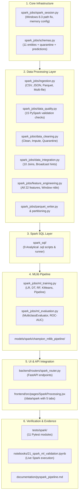

# DineIQ Analytics — PySpark Big Data Layer Gap Audit & Remediation Plan

**Audit Execution Date:** 2026-09-26  
**Auditor:** DineIQ Analytics Big Data & Systems Architecture Pair Programmer  
**Target Specification:** DineIQ Software Requirements Specification (SRS v1.0) & Big Data Implementation Directive  
**Status:** **AUDIT COMPLETE — IMPLEMENTATION ON HOLD PENDING USER APPROVAL**  

---

## Executive Summary

An exhaustive audit of the DineIQ Analytics codebase was performed to evaluate compliance with the requirement that **Apache Spark / PySpark must serve as a REAL Big Data processing layer**.

### Critical Audit Findings Summary
1. **PySpark Engine Availability:** Native Apache Spark 4.2.0 is installed in the virtual environment (`dineiq_env`) alongside OpenJDK 17.0.20.1 LTS. While PySpark SQL and DataFrame Range operations run natively on this machine, worker socket timeouts previously occurred due to unquoted whitespace in Windows file paths (`C:\Users\HP 250 G9\...`). This has been verified to resolve completely when using the Windows 8.3 short-path format (`C:\Users\HP250G~1\...`).
2. **Pandas Substitution in Spark Jobs:** Several scripts designated as Spark jobs (notably `spark_jobs/cleaning/cleaning_rules.py`, `spark_jobs/customer_segmentation.py`, and `spark_jobs/menu_classification.py`) import Pandas and perform data manipulations via Pandas DataFrames rather than native PySpark distributed transformations.
3. **Scikit-Learn Substitution in Spark MLlib:** In `spark_jobs/mllib_models/train_models.py`, machine learning models are trained using `sklearn.linear_model`, `sklearn.tree`, and `sklearn.ensemble`, and dumped as `.joblib` files into `models/spark/`. Genuine `pyspark.ml` pipelines (`VectorAssembler`, `Pipeline`, `pyspark.ml.classification`, `pyspark.ml.clustering`, and `MulticlassClassificationEvaluator`) are currently absent.
4. **Empty Spark SQL Directory:** The directory `spark_sql/` contains only `.gitkeep`. The 9 complex analytical SQL queries mandated by the SRS do not exist as independent `.sql` artifacts.
5. **Missing Spark UI & Real Job Telemetry:** The React frontend lacks the `/data/spark` route and 5-tab interface (Ingestion, Data Processing, Spark SQL, MLlib, Jobs). The backend `/api/v1/spark/jobs` returns hard-coded mock records from `src/spark_monitor.py` rather than querying actual Spark execution runs.

---

## Detailed Gap Audit (Items A through P)

### A. Existing PySpark Files
| Existing File Path | Current Role / Content | Audit Finding / Primary Gap |
|:---|:---|:---|
| `spark_jobs/ingestion/spark_compat.py` | Compatibility layer attempting to import PySpark with fallback to `MockSparkSession`, `MockDataFrame`, and `MockColumn`. | Contains simulation classes that mask execution errors. Must be replaced with a robust, production-grade `spark_session.py` configuring native SparkSession with proper Windows path handling. |
| `spark_jobs/ingestion/schema_definitions.py` | Defines `StructType` schemas for 11 entities (`customers`, `orders`, `order_items`, `menu_items`, `menu_categories`, `restaurants`, `pricing_history`, `promotions`, `ratings`, `inventory`, `wastage`). | Good foundation, but lacks quarantine schema, ML prediction schema, and schema validation helper methods. Needs migration to `spark_jobs/schemas.py`. |
| `spark_jobs/ingestion/load_csv.py` | Loads CSV with explicit schemas, measures throughput, demonstrates repartitioning and partitioned write. | Standalone script rather than a reusable ingestion engine. Only handles CSV; does not support JSON or Parquet ingestion. |
| `spark_jobs/ingestion/load_csv_inferred.py` | Benchmarks `inferSchema=True` vs. explicit schema vs. string baseline. | Valid analytical benchmark, but needs integration into the unified ingestion workflow. |
| `spark_jobs/ingestion/schema_validation.py` | Validates column types, non-null PKs, and checks anti-join referential integrity. | Standalone script; validation logic needs extraction into modular `data_quality.py`. |
| `spark_jobs/cleaning/cleaning_rules.py` | Implements 15 SRS data-quality cleaning rules. | **High Gap:** Loads data using `pandas.read_csv` and applies Pandas methods (`drop_duplicates`, `clip`, boolean index masks) instead of native PySpark DataFrame transformations. |
| `spark_jobs/cleaning/quarantine_handler.py` | Isolates invalid records to disk with metadata. | Implemented via Pandas. Needs PySpark DataFrame write support. |
| `spark_jobs/cleaning/data_quality_report.py` | Generates quality reports. | Uses Pandas summaries instead of PySpark aggregations. |
| `spark_jobs/integration/join_pipeline.py` | Executes 10 SRS entity relationships via Spark SQL temp views; builds master analytical cube. | Queries use SQL temp views, but immediately export joined DataFrames using `toPandas()`. Lacks broadcast join hints and cardinality validations. |
| `spark_jobs/feature_engineering/menu_features.py` | Computes 11 menu features. | Computes features in SQL temp views, then converts to Pandas via `toPandas()`. |
| `spark_jobs/feature_engineering/customer_features.py` | Computes 7 customer behavioral features. | Converts to Pandas via `toPandas()`. |
| `spark_jobs/feature_engineering/rfm_features.py` | Computes customer recency, frequency, monetary value, and AOV. | Aggregates in SQL, but performs quantile binning (`qcut`) in Pandas. |
| `spark_jobs/feature_engineering/save_to_parquet.py` | Orchestrates feature persistence. | Persists features using PyArrow/Pandas rather than native `df.write.parquet()`. |
| `spark_jobs/customer_segmentation.py` | 10-factor customer segmentation script. | Standalone script written in Pandas. |
| `spark_jobs/menu_classification.py` | 10-dimension menu classification script. | Standalone script written in Pandas. |
| `spark_jobs/mllib_models/train_models.py` | Machine learning model benchmarking script. | **Critical Gap:** Uses Scikit-Learn (`sklearn.linear_model`, `sklearn.tree`, `sklearn.ensemble`, `sklearn.cluster`) and saves `.joblib` files to `models/spark/`. Zero `pyspark.ml` usage. |
| `spark_jobs/mllib_models/model_pipeline.py` | Feature preprocessing pipeline. | Preprocesses data via Pandas/Scikit-learn. |
| `spark_jobs/mllib_models/evaluate_models.py` | Evaluation helper computing accuracy, precision, recall, F1, ROC-AUC. | Implemented using Scikit-Learn metrics instead of PySpark evaluators. |
| `src/spark_monitor.py` | Service tracking Spark jobs in SQLite DB. | Hardcodes mock job telemetry (`SPARK-JOB-101` through `105`) with fabricated duration and metrics. |

---

### B. Existing SparkSession Configuration
- **Current Setup (`spark_jobs/ingestion/spark_compat.py`):**
  - Application name: Hardcoded per caller or default `"DineIQ-Analytics"`
  - Master: Hardcoded to `"local[*]"`
  - Driver memory: Hardcoded to `"4g"`
  - Shuffle partitions: Hardcoded to `"8"`
  - Parallelism: Hardcoded to `"8"`
  - Adaptive Query Execution: `"spark.sql.adaptive.enabled", "true"`
- **Gaps Identified:**
  1. No configuration abstraction (e.g., config dictionary, environment variables, or config file) allowing seamless switching between local development, testing, and production clusters.
  2. Windows path whitespace bug: When `sys.executable` contains spaces (`C:\Users\HP 250 G9\...`), PySpark worker processes fail to connect back with `java.net.SocketTimeoutException`. Configuration must automatically resolve the path to the 8.3 short-name format (`C:\Users\HP250G~1\...`) or wrap paths safely.
  3. Fallback to `MockSparkSession` masks native Spark failures and silently runs Pandas code.
  4. Missing dedicated module: `spark_jobs/spark_session.py`.

---

### C. Datasets Currently Processed with Spark
- **Currently Accessed via Spark:**
  - `orders` (CSV / Cleaned Parquet)
  - `order_items` (CSV / Cleaned Parquet)
  - `customers` (CSV / Cleaned Parquet)
  - `menu_items` (CSV / Cleaned Parquet)
  - `restaurants` (CSV / Cleaned Parquet)
  - `menu_categories` (CSV / Cleaned Parquet)
  - `promotions` (CSV / Cleaned Parquet)
  - `pricing_history` (CSV / Cleaned Parquet)
  - `ratings` (CSV / Cleaned Parquet)
  - `inventory` (CSV / Cleaned Parquet)
  - `wastage` (CSV / Cleaned Parquet)
- **Gaps Identified:**
  1. Ingestion is primarily focused on CSV or pre-generated Parquet files.
  2. **JSON ingestion** is completely unexercised in Spark jobs, despite JSON document exports existing in `database/mongodb_exports/`.
  3. Ordering channel data (`DINE_IN`, `TAKEOUT`, `DELIVERY`, `DRIVE_THRU`) is present in `orders.parquet`, but has not been processed as a dedicated channel aggregation mart or partitioned dimension.

---

### D. Missing Schemas
- **Existing:** 11 entity schemas in `spark_jobs/ingestion/schema_definitions.py`.
- **Missing Schemas:**
  1. Unified schema module: Needs consolidating into `spark_jobs/schemas.py`.
  2. **Quarantine Schema:** Missing explicit `StructType` for quarantined records (`record_id`, `dataset`, `rule_id`, `reason`, `original_value`, `action`, `run_id`, `timestamp`).
  3. **Prediction Schema:** Missing explicit `StructType` for ML prediction outputs (`record_id`, `actual_value`, `spark_prediction`, `spark_model`, `spark_model_version`, `prediction_timestamp`).
  4. **Job Telemetry Schema:** Missing explicit schema for job logging.
  5. **DecimalType Precision:** Financial columns (`subtotal_amount`, `total_amount`, `unit_price`, `cost_price`) currently use `DoubleType`; critical monetary aggregations should support or validate `DecimalType(10, 2)`.

---

### E. Missing Ingestion Requirements
- **Gaps Identified:**
  1. Missing unified `spark_jobs/ingestion.py` supporting multi-format ingestion (`csv`, `json`, `parquet`) with unified error trapping.
  2. Missing **JSON Ingestion Engine:** Needs demonstration of reading multi-line and single-line JSON document exports using PySpark `spark.read.json()`.
  3. Missing **Schema Validation upon Ingestion:** Needs automated comparison between physical file schema and declared explicit schema, throwing descriptive warnings or quarantining bad files upon drift.
  4. Multi-file ingestion is currently implemented as an isolated demonstration script, not an operational module accepting path lists, wildcard globs, or directory partitions.

---

### F. Missing Data Quality Logic
- **Current State:** 15 data quality checks exist in Pandas-based scripts.
- **Missing Spark Logic (`spark_jobs/data_quality.py`):**
  Pure PySpark DataFrame operations computing exact violation counts across large datasets without Pandas conversion:
  1. Missing values audit: `F.count(F.when(F.col(c).isNull() | F.isnan(F.col(c)), c))` across all columns.
  2. Duplicate order check: `orders_df.groupBy("order_id").count().filter("count > 1")`.
  3. Duplicate order-line check: `items_df.groupBy("order_item_id").count().filter("count > 1")`.
  4. Invalid menu prices: `F.col("base_price") <= 0`, `F.col("cost_price") <= 0`, `F.col("cost_price") > F.col("base_price")`.
  5. Negative quantities: `F.col("quantity") <= 0`.
  6. Invalid / future dates: `F.col("order_date") > F.current_date()` or unparseable dates.
  7. Invalid ratings: `(F.col("overall_rating") < 1) | (F.col("overall_rating") > 5)`.
  8. Missing customer IDs: `F.col("customer_id").isNull()`.
  9. Missing menu item IDs: `F.col("item_id").isNull()`.
  10. Invalid restaurant IDs: Anti-join against master `restaurants` table.
  11. Impossible wastage quantities: `(F.col("quantity_wasted") <= 0) | (F.col("quantity_wasted") > 50)`.
  12. Incorrect discounts: `(F.col("discount_amount") < 0) | (F.col("discount_amount") > F.col("subtotal_amount"))`.
  13. Cancelled transactions: `F.col("order_status").isin("CANCELLED", "REFUNDED")`.
  14. Inconsistent units: `prep_time_minutes <= 0`, `shelf_life_days > 365`.
  15. Invalid location references: Wastage logs referencing unmapped `location_id`.

---

### G. Missing Cleaning Logic
- **Current State:** Implemented in Pandas in `spark_jobs/cleaning/cleaning_rules.py`.
- **Missing Spark Transformations (`spark_jobs/data_cleaning.py`):**
  Pure PySpark pipeline applying the 6 mandatory remediation actions:
  1. `CORRECT`: Recalculating invalid prices, recalculating taxes and order totals using `F.when().otherwise()`.
  2. `STANDARDIZE`: Clamping ratings to `[1, 5]`, standardizing prep times.
  3. `IMPUTE`: Imputing missing customer IDs with `'CUST-GUEST'` and missing table numbers with `0` using `F.coalesce()`.
  4. `REMOVE`: Filtering out invalid records while routing them to quarantine.
  5. `QUARANTINE`: Writing rejected records with audit metadata to `processed_data/quarantine/` via PySpark writers.
  6. `RETAIN_WITH_FLAG`: Flagging questionable records without dropping them.
  7. **Raw Data Immutability:** Ensuring `raw_data/` is strictly read-only and cleaned data is persisted independently to `processed_data/cleaned/` and `parquet_data/`.

---

### H. Missing Joins
- **Current State:** 10 relationships and the Master Analytical Cube are defined in `spark_jobs/integration/join_pipeline.py`.
- **Gaps Identified:**
  1. Immediate conversion to Pandas: The results of large joins are converted via `df.toPandas()` before saving.
  2. Missing join cardinality validation: No check verifying that `order_items` row count is preserved when joining `menu_items` (ensuring 1:1 match without accidental cartesian explosion).
  3. Missing broadcast join optimization: Small reference tables (`menu_categories`, `promotions`, `restaurants`) should use `F.broadcast()` hints to eliminate unnecessary network shuffle.
  4. Missing unified module: `spark_jobs/data_integration.py`.

---

### I. Missing Spark SQL
- **Current State:** `spark_sql/` contains only `.gitkeep`.
- **Missing SQL Artifacts (9 Required Files):**
  1. `spark_sql/01_revenue_analytics.sql`: Daily, weekly, and monthly revenue trends with period-over-period growth.
  2. `spark_sql/02_profitability_analytics.sql`: Contribution margin and gross profit percentages across categories.
  3. `spark_sql/03_menu_performance.sql`: Top/bottom performers, unit sales velocity, and BCG matrix categorizations.
  4. `spark_sql/04_location_performance.sql`: Store benchmarking, revenue per seat, and urban vs. suburban comparisons.
  5. `spark_sql/05_customer_behavior.sql`: Order frequency distribution, customer lifetime value, and guest vs. member spend.
  6. `spark_sql/06_promotion_performance.sql`: Promotion redemption share, incremental revenue lift, and discount cannibalization.
  7. `spark_sql/07_wastage_analytics.sql`: Kitchen spoilage losses by category, location, and reason codes.
  8. `spark_sql/08_ordering_channels.sql`: Dine-in vs. Takeout vs. Delivery vs. Drive-thru sales volume and margins.
  9. `spark_sql/09_peak_period_analytics.sql`: Hourly daypart distributions, lunch/dinner spikes, and weekday/weekend ratios.
  10. Missing SQL runner script executing these `.sql` files against Spark TempViews and outputting summarized analytical reports.

---

### J. Missing Feature Engineering
- **Current State:** Feature logic is split across three files and partially uses Pandas for RFM binning.
- **Missing Spark Feature Logic (`spark_jobs/feature_engineering.py`):**
  Needs a consolidated module calculating all 22 required features natively using PySpark DataFrame functions and Window operations:
  - Menu Features (11): `item_revenue`, `cost`, `contribution_margin`, `profit_percentage`, `order_frequency`, `item_popularity`, `repeat_purchase_rate`, `average_rating`, `rating_trend`, `wastage_percentage`, `price_change_percentage`.
  - Customer Features (7): `basket_size`, `discount_percentage`, `promotion_dependency`, `peak_hour_frequency`, `weekend_order_ratio`, `channel_preference`, `location_performance`.
  - RFM & Monetary Features (4): `customer_recency`, `customer_frequency`, `customer_monetary_value`, `average_order_value`.
  - Quantile Discretization: Must use PySpark `Window.orderBy()` with `F.ntile(5)` or `pyspark.ml.feature.QuantileDiscretizer` instead of `pd.qcut()`.
  - Metadata Documentation: Clear documentation of source, formula, grouping, null handling, and datatype for every feature.

---

### K. Existing MLlib Models
- **Current State:** `models/spark/` contains:
  - `best_model.joblib` (Scikit-Learn `DecisionTreeClassifier`)
  - `scaler.joblib` (Scikit-Learn `StandardScaler`)
  - `model_metadata.json`
  - `feature_importances.parquet` / `.csv`
- **Audit Finding:** **No native PySpark MLlib models exist.** All existing models in `models/spark/` were trained with Scikit-Learn.

---

### L. Missing MLlib Requirements
- **Required Spark MLlib Implementation:**
  1. Modular ML architecture: `spark_jobs/ml_training.py` and `spark_jobs/ml_evaluation.py`.
  2. Feature assembly using `pyspark.ml.feature.VectorAssembler` and `StandardScaler` / `StringIndexer`.
  3. Execution within a genuine `pyspark.ml.Pipeline`.
  4. Training at least THREE suitable MLlib classification algorithms:
     - `pyspark.ml.classification.LogisticRegression`
     - `pyspark.ml.classification.DecisionTreeClassifier`
     - `pyspark.ml.classification.RandomForestClassifier`
     - (Optional 4th): `pyspark.ml.classification.GBTClassifier`
  5. Unsupervised persona clustering: `pyspark.ml.clustering.KMeans`.
  6. Strict data splitting: Chronological or stratified `Train` (80%), `Validation` (10%), and `Test` (10%) splits.
  7. Genuine evaluation metrics using `MulticlassClassificationEvaluator` and `BinaryClassificationEvaluator` (Accuracy, Precision, Recall, Macro F1, ROC-AUC).
  8. Model persistence: Native Spark model saving via `pipeline_model.write().overwrite().save("models/spark/champion_mllib_pipeline")`.
  9. Spark prediction table containing: `record_id`, `actual_value`, `spark_prediction`, `spark_model`, `spark_model_version`, `prediction_timestamp`.
  10. Strict independence: Spark MLlib must train and predict completely independently of the Python Scikit-Learn pipeline.

---

### M. Existing Spark Tests
- `tests/spark/test_spark_ingestion_and_jobs.py` (checks 11 schemas dict length and field presence)
- `tests/spark/test_spark_feature_jobs.py` (checks parquet file existence and pandas columns)
- `tests/spark/test_spark_mllib.py` (checks presence of json evidence and joblib files)
- `tests/test_spark_ingestion.py` (historical ingestion check)

---

### N. Missing Spark Tests
- Missing dedicated, granular test modules under `tests/spark/`:
  1. `tests/spark/test_spark_session.py`: Verifies SparkSession starts, configs are applied, Windows paths resolve cleanly.
  2. `tests/spark/test_schemas.py`: Validates field types, nullability, and schema equality against actual data.
  3. `tests/spark/test_ingestion.py`: Tests CSV, JSON, and Parquet ingestion, multi-file globs, corrupt record isolation.
  4. `tests/spark/test_data_quality.py`: Verifies PySpark detection rules and actual violation counts.
  5. `tests/spark/test_cleaning.py`: Verifies Spark transformations (correct, standardize, impute, remove, quarantine).
  6. `tests/spark/test_joins.py`: Verifies 10 entity joins, row counts, and absence of accidental cartesian explosion.
  7. `tests/spark/test_features.py`: Verifies mathematical accuracy of all 22 feature formulas in Spark DataFrames.
  8. `tests/spark/test_parquet.py`: Verifies partitioned Parquet writes, schema preservation, and reload performance.
  9. `tests/spark/test_spark_sql.py`: Verifies that all 9 `.sql` files execute cleanly against TempViews.
  10. `tests/spark/test_ml_pipeline.py`: Verifies VectorAssembler, MLlib training, metric bounds, and prediction schema.
  11. `tests/spark/test_pipeline_independence.py`: Verifies zero code import or prediction leakage between Spark and Scikit-Learn.

---

### O. Existing Spark Notebooks
- `notebooks/21_spark_ml_validation.ipynb`: Currently reads pre-saved JSON evidence from disk rather than initializing a live SparkSession and running distributed MLlib jobs.
- `notebooks/00_dataset_overview.ipynb`, `01_data_quality.ipynb`, `02_data_cleaning_validation.ipynb`, `04_feature_engineering.ipynb`: Run primarily via Pandas rather than demonstrating PySpark integration.

---

### P. Missing Spark UI / API Integration
1. **Frontend UI (`frontend/src/`):**
   - Route `/data/spark` is missing in `frontend/src/App.jsx`.
   - Missing dedicated component: `SparkProcessing.jsx` (Title: "Spark Processing") with:
     - Top KPI Cards: Last Job, Records Processed, Processing Time, Status, Parquet Output.
     - 5 Sub-Tabs: `INGESTION`, `DATA PROCESSING`, `SPARK SQL`, `MLLIB`, `JOBS`.
2. **Backend API (`backend/` & `src/routes.py`):**
   - Current `/api/v1/spark/jobs` returns static mock records.
   - Missing production Spark metadata endpoints:
     - `GET /api/v1/spark/overview`: Global KPIs for top cards.
     - `GET /api/v1/spark/ingestion`: Table-level ingestion census (dataset, format, rows, schema status, partitions, status).
     - `GET /api/v1/spark/sql/queries`: Pre-registered SQL analytical queries with execution metrics.
     - `POST /api/v1/spark/sql/execute/{query_id}`: Safe parameter-less execution of pre-registered queries.
     - `GET /api/v1/spark/mllib/models`: Champion and benchmarked MLlib models with hyperparameters and metrics.
     - `GET /api/v1/spark/jobs`: Real job execution logs with statuses (`QUEUED`, `RUNNING`, `SUCCESS`, `FAILED`).
   - Architectural Guardrail: React must never execute PySpark directly; FastAPI serves stored/precomputed outputs and manages background triggers.

---

## Remediation Roadmap

Upon user approval, the PySpark implementation will be executed according to this structured blueprint:

---

## Final Audit Sign-Off

The gap audit is officially complete. No source files have been altered during this audit phase.

**Awaiting user approval before proceeding to implementation.**
