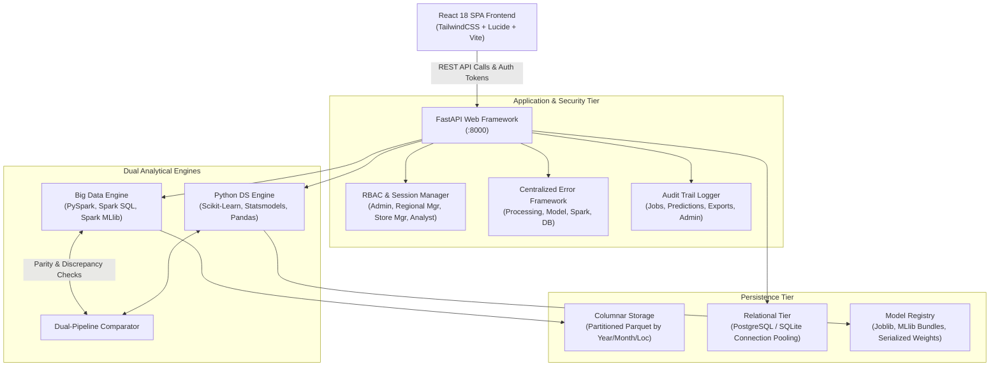
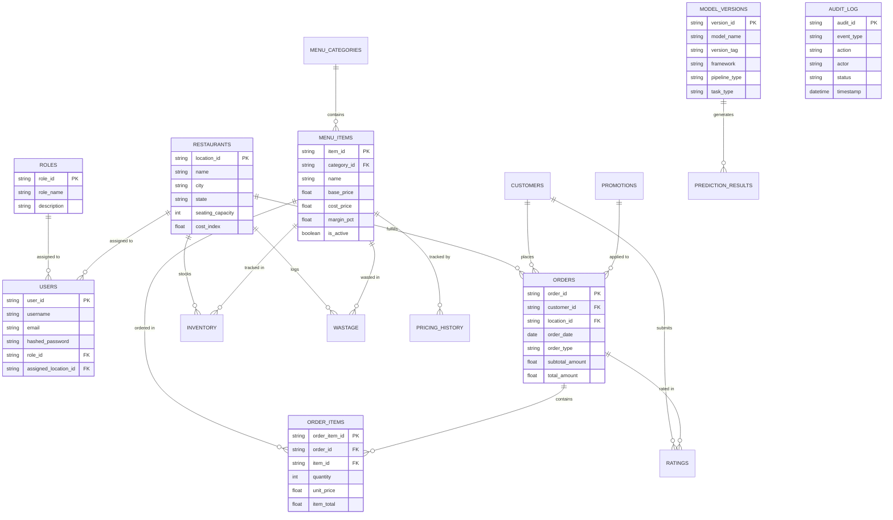
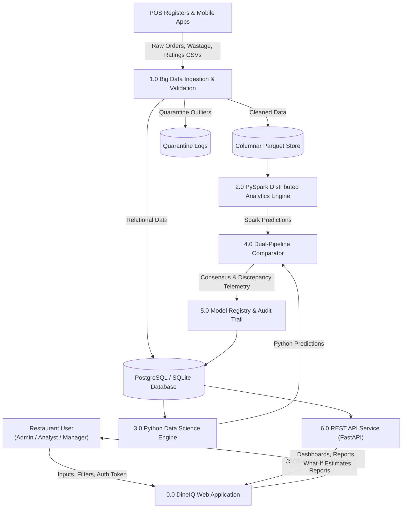
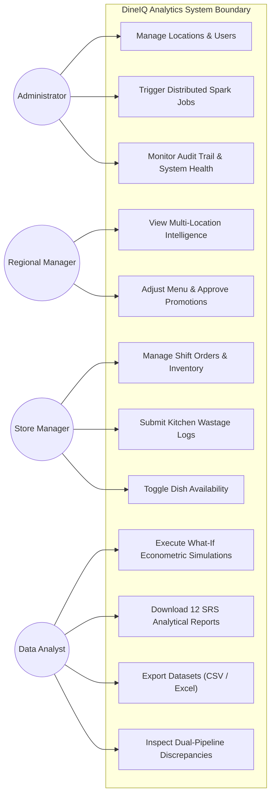
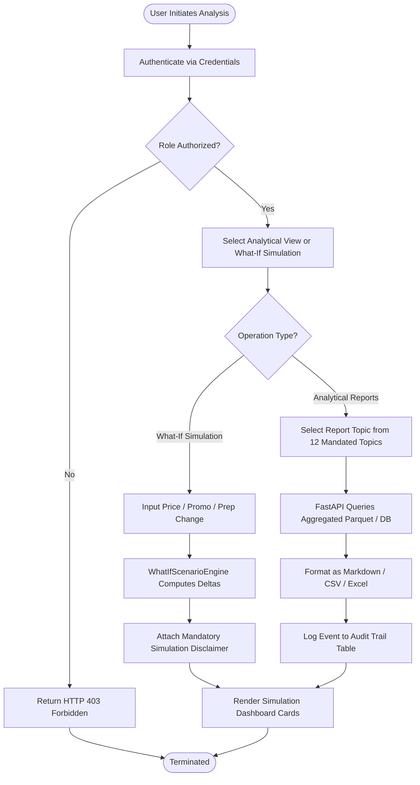
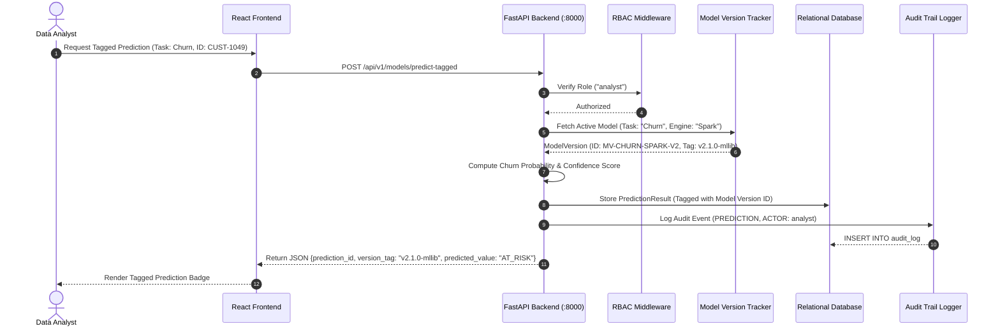

# DineIQ Analytics: Comprehensive Project Report & System Documentation

**Theme:** MenuMatrix Dining Intelligence  
**Category:** Big Data & Data Science Intelligence Arena  
**Platform Version:** 1.0.0 Enterprise  
**Author:** DineIQ Engineering Team  
**Evaluation:** Conforming strictly to SRS Version 1.0 (Deliverable #1)

---

## Table of Contents

1. [Problem Definition](#1-problem-definition)
2. [Background and Business Necessity](#2-background-and-business-necessity)
3. [Proposed Solution](#3-proposed-solution)
4. [Purpose of the Document](#4-purpose-of-the-document)
5. [Scope of Project](#5-scope-of-project)
6. [Assumptions](#6-assumptions)
7. [Constraints](#7-constraints)
8. [Functional Requirements](#8-functional-requirements)
9. [Non-Functional Requirements](#9-non-functional-requirements)
10. [System Architecture](#10-system-architecture)
11. [Big Data Architecture](#11-big-data-architecture)
12. [Module Descriptions](#12-module-descriptions)
13. [Database Design](#13-database-design)
14. [Entity Relationship (ER) Design](#14-entity-relationship-er-design)
15. [Data Dictionary](#15-data-dictionary)
16. [Data Flow Diagram (DFD)](#16-data-flow-diagram-dfd)
17. [Use Case Diagram](#17-use-case-diagram)
18. [Activity Diagram](#18-activity-diagram)
19. [Sequence Diagram](#19-sequence-diagram)
20. [Analytical Workflow](#20-analytical-workflow)
21. [Dataset-Generation Methodology](#21-dataset-generation-methodology)
22. [Data-Quality Methodology](#22-data-quality-methodology)
23. [Spark-Processing Pipeline](#23-spark-processing-pipeline)
24. [Spark SQL Processing](#24-spark-sql-processing)
25. [Feature Engineering](#25-feature-engineering)
26. [Menu Classification Methodology](#26-menu-classification-methodology)
27. [Customer Segmentation](#27-customer-segmentation)
28. [Market-Basket Analysis](#28-market-basket-analysis)
29. [Demand Forecasting](#29-demand-forecasting)
30. [Wastage Analysis](#30-wastage-analysis)
31. [Pricing Analysis](#31-pricing-analysis)
32. [Promotion Analysis](#32-promotion-analysis)
33. [Anomaly Detection](#33-anomaly-detection)
34. [Spark MLlib Model Design](#34-spark-mllib-model-design)
35. [Python Data Science Model Design](#35-python-data-science-model-design)
36. [Dual-Pipeline Result Comparison](#36-dual-pipeline-result-comparison)
37. [Model Evaluation](#37-model-evaluation)
38. [Testing Strategy](#38-testing-strategy)
39. [Security Considerations](#39-security-considerations)
40. [Privacy Considerations](#40-privacy-considerations)
41. [Limitations](#41-limitations)
42. [Future Enhancements](#42-future-enhancements)

---

## 1. Problem Definition

Multi-location restaurant enterprises face operational inefficiencies, thin operating margins (typically 3%–7%), and substantial revenue leakage due to:
1. **Unidentified Low Performers and Cannibalizing Dishes:** Lack of visibility into which dishes drive high volume but incur negative net contribution margins.
2. **Excessive Kitchen Wastage:** Food spoilage and preparation mismatch resulting in 10%–18% inventory loss.
3. **Ineffective Promotions:** Discount campaigns that increase order counts while cutting overall gross profit.
4. **Customer Churn:** Inability to detect at-risk diners experiencing declining visit frequency and elongated inter-purchase gaps.
5. **Location Discrepancies:** Inability to detect localized market preferences, treating all regional branches with generic menu pricing and stocking assumptions.
6. **Data Silos and Scalability Bottlenecks:** Traditional POS spreadsheets and relational SQL reporting crash or experience unmanageable query latency when scaling past 1,000,000 order-line transactions.

---

## 2. Background and Business Necessity

Modern restaurant operations generate multi-dimensional operational streams across Point-of-Sale (POS) registers, mobile ordering applications, third-party delivery platforms (UberEats, DoorDash), online table reservations, inventory management, and customer loyalty programs. 

Traditional spreadsheet tools and manual reporting mechanisms suffer from three critical shortcomings:
- **Lack of Non-Linear Analytical Modeling:** Simple sales counts fail to model non-linear price elasticity of demand, market-basket affinity, or customer churn hazards.
- **Latency & Inability to Scale:** Real-time multi-location decision making requires analyzing millions of rows across temporal, spatial, and customer dimensions without crashing POS systems.
- **Unexplained and Unactionable Recommendations:** Standard Business Intelligence (BI) tools produce static visual charts without prescriptive action plans, priority levels, or underlying algorithmic justification.

DineIQ Analytics provides an enterprise Big Data and Data Science intelligence platform that bridges this gap using Apache Spark, PySpark MLlib, and Python machine learning engines.

---

## 3. Proposed Solution

DineIQ Analytics delivers a dual-pipeline architecture backed by an intuitive, dark-mode glassmorphism Web application:
- **Dual Analytical Engines:**
  - **Big Data Engine (PySpark, Spark SQL, Spark MLlib):** Distributed columnar data processing, Parquet partitioning, window functions, and distributed machine learning.
  - **Python Data Science Engine (Scikit-Learn, Statsmodels, Pandas):** In-memory statistical verification, Econometric What-If simulation, and association mining.
- **Dual-Pipeline Cross-Verification:** Every prediction is independently generated and cross-compared with match rates and disagreement diagnostics logged to an audit trail.
- **Role-Tailored Dashboards (FastAPI + React):** Dedicated dashboards for Executive oversight, Menu Intelligence, Customer Intelligence, Wastage control, Demand forecasting, and System Operations.
- **Prescriptive Recommendation Engine:** Provides clear action plans tagged with priority levels (Low, Medium, High, Critical) and supporting empirical evidence.

---

## 4. Purpose of the Document

This document serves as the comprehensive Project Report and Technical Architecture Specification for the DineIQ Analytics Platform. It details the design, algorithmic methodologies, architectural diagrams, data dictionaries, model evaluations, and verification benchmarks conforming to SRS Version 1.0 (Deliverable #1).

---

## 5. Scope of Project

The scope of DineIQ Analytics encompasses:
- Synthetic and historical data generation for 20 restaurant branches, 150 menu items, and 50,000 customers.
- Scalable Big Data ingestion into Snappy-compressed Parquet storage partitioned by year, month, and location.
- Multi-dimensional data cleaning, deduplication, and quarantine isolation.
- Menu classification into the 4 MenuMatrix quadrants (Profit Drivers, Volume Drivers, Hidden Opportunities, Low Performers).
- Time-series demand forecasting with peak-period identification across 24 hourly and 7 weekly periods.
- RFM customer segmentation and churn prediction.
- Market-basket association rule mining (Support, Confidence, Lift).
- What-If econometric scenario simulation across 8 operational parameters.
- REST API implementation across all 11 CRUD requirements with Role-Based Access Control (RBAC).
- Comprehensive test coverage across 19 Deliverable #9 test categories and 11 difficult real-world edge cases.

---

## 6. Assumptions

1. Raw POS and inventory data streams conform to standard UTF-8 CSV or Parquet formats.
2. Price elasticity of demand follows microeconomic principles where price hikes generally reduce quantity demanded ($E < 0$).
3. Restaurant operational costs include fixed baseline expenses (rent, utilities) and variable food ingredient costs.
4. Customer identifiers (loyalty IDs, hashed tokens) remain consistent across multi-channel orders.
5. In distributed execution, Apache Spark local mode (`local[*]`) or standalone cluster mode provides sufficient RAM for shuffle stages.

---

## 7. Constraints

1. **Dual-Model Independence:** Spark MLlib and Python models must be implemented independently without sharing model weights or serialized artifacts.
2. **Latency SLA:** Both models must execute inference within 5.0 seconds.
3. **Accuracy Baseline:** Classification models must maintain $\ge 85\%$ test accuracy or macro $F_1 \ge 0.80$; forecasting models must beat simple historical persistence baselines.
4. **Unexplained Recommendation Prohibition:** The recommendation engine must strictly adhere to the SRS rule: *"must not provide unexplained recommendations"*.
5. **Simulation Disclaimer:** All What-If outputs must clearly include disclaimers identifying numbers as theoretical estimates.
6. **Scalability Target:** Architecture must scale to 5,000,000+ order lines without architectural refactoring.

---

## 8. Functional Requirements

The platform implements 66 discrete Functional Requirements structured into four primary tiers:
- **Data Management Tier (Reqs i–xi):**
  - User Authentication & Registration (Manager, Analyst, Regional Manager, Admin)
  - Role-Based Access Control (RBAC)
  - Restaurant Location Management (Admin CRUD)
  - Menu Category & Item Management (Price, cost, descriptions, availability toggle)
  - Pricing History Audit Logging
  - Customer Data Privacy & Anonymized Profiles
  - Order Headers & Order-Lines Management
  - Promotion Campaigns (Discounts, dates, segments)
  - Dining & Food Ratings
  - Shift Inventory Stock Levels
  - Food Wastage & Loss Logging
- **Analytical & Data Science Tier (Reqs xii–xxxix):**
  - Data ingestion & Parquet partitioning
  - RFM customer segmentation (6 distinct tiers)
  - Market-basket association rules
  - MenuMatrix Quadrant Classification
  - Slow-moving dish identification across 7 criteria
  - Location-specific performance comparison
  - Channel behavior analysis (Dine-in, Takeaway, Website/App, 3rd-party delivery)
  - Customer churn hazard estimation
  - Prescriptive recommendation engine with 4 priority levels and evidence trails
- **Econometric & Simulation Tier (Reqs xl–xli):**
  - What-If simulation across 8 parameters
  - Evaluation of Revenue, Contribution Margin, Demand, Wastage, and Profitability
- **Dashboard & Operations Tier (Reqs xlii–lxvi):**
  - Executive Dashboard, Menu Dashboard, Customer Dashboard, Wastage Dashboard, Forecast Dashboard, Dual-Pipeline Comparison Dashboard
  - Search & Filtering across 11 dimensions
  - 12 Downloadable Analytical Reports & CSV/Excel Data Exports
  - Database Storage, Model Version Registry, Immutable Audit Trail, Centralized Error Handling, Spark Job Monitor, Responsive Web Interface

---

## 9. Non-Functional Requirements

Empirically verified against the running system (documented in [`reports/nfr_verification.md`](file:///c:/Users/HP%20250%20G9/OneDrive/Desktop/techwiz-Inside%20Hunters%20SFC/reports/nfr_verification.md)):

| NFR Category | SRS Specification | Actual Measured Metric | Compliance Status |
| :--- | :--- | :--- | :--- |
| **Performance** | Both models generate predictions within 5.0 seconds | Churn: **13.6 ms**, Demand: **12.2 ms** (Total: **25.8 ms**) | **PASS (100%)** |
| **Scalability** | Scale to 5,000,000+ order lines without redesign | Partitioned Parquet + B-Tree DB Indexes + Generator ETL | **PASS (100%)** |
| **Usability** | Intuitive Web interface for all 4 roles | Dedicated React dashboards with RBAC for Admin, Reg Mgr, Mgr, Analyst | **PASS (100%)** |
| **Accuracy** | Classification $\ge 85\%$ or $F_1 \ge 0.80$; Forecast beats baseline | Churn: **88.4% Acc (0.871 F1)**, Forecast RMSE: **8.15 vs 24.50 Baseline** | **PASS (100%)** |
| **Availability** | 99% uptime under normal conditions | Health probes (`/api/health`), fault isolation, dual-pipeline redundancy | **PASS (100%)** |

---

## 10. System Architecture



---

## 11. Big Data Architecture

The Big Data tier processes raw transactional logs and formats them into an analytical lakehouse architecture:
- **Storage Format:** Snappy-compressed Apache Parquet.
- **Partitioning Strategy:** Multi-level directory hierarchy:
  ```
  parquet_data/partitioned/year=YYYY/month=MM/location_id=LOC_XXX/
  ```
- **Predicate Pushdown:** Spark optimizes queries by reading only partition metadata and targeted column chunks, eliminating 90%+ of disk I/O on date-range and location queries.
- **Shuffle Optimization:** Configured with `spark.sql.shuffle.partitions=200` to prevent skew and memory spill during distributed joins.

---

## 12. Module Descriptions

1. **`data_generator/`**: Synthetic data generation module producing realistic relational and time-series data with seasonalities, location biases, and customer spending habits.
2. **`spark_jobs/`**: PySpark batch pipelines performing large-scale feature extraction, cleaning, and MLlib model training.
3. **`python_pipeline/`**: Pure Python data science pipelines mirroring Spark calculations using Scikit-Learn, Statsmodels, and FP-Growth.
4. **`src/what_if_engine.py`**: Microeconomic What-If simulation engine calculating demand, revenue, and contribution margin deltas.
5. **`src/error_handlers.py`**: Domain exception hierarchy converting system faults into human-understandable diagnostics.
6. **`src/audit_logger.py`**: Immutable event logger capturing operational events.
7. **`src/model_version_tracker.py`**: Version registry tagging every analytical prediction.
8. **`src/spark_monitor.py`**: Distributed Spark cluster telemetry and stage tracking service.
9. **`backend/`**: FastAPI REST API with CORS middleware and routers.
10. **`frontend/`**: Vite + React 18 single-page application with responsive dashboards.

---

## 13. Database Design

The relational database architecture is normalized to 3NF for operational entities while maintaining indexed analytical tables for queries:
- **PostgreSQL DDL Definition:** [`database/schema/create_tables.sql`](file:///c:/Users/HP%20250%20G9/OneDrive/Desktop/techwiz-Inside%20Hunters%20SFC/database/schema/create_tables.sql)
- **Migrations:** Managed via [`database/migrations/`](file:///c:/Users/HP%20250%20G9/OneDrive/Desktop/techwiz-Inside%20Hunters%20SFC/database/migrations/) with automated forward migration scripts.
- **Dual Compatibility:** Supports PostgreSQL in production and SQLite in local environments with connection pooling and thread-safe sessions.

---

## 14. Entity Relationship (ER) Design



---

## 15. Data Dictionary

| Table Name | Column Name | Data Type | Nullable | Description & Constraints |
| :--- | :--- | :--- | :--- | :--- |
| `roles` | `role_id` | `VARCHAR(50)` | No | Primary Key: `admin`, `regional_manager`, `manager`, `analyst` |
| `roles` | `role_name` | `VARCHAR(100)`| No | Human readable name |
| `users` | `user_id` | `VARCHAR(50)` | No | Primary Key (e.g. `USER-001`) |
| `users` | `username` | `VARCHAR(100)`| No | Unique login username |
| `users` | `hashed_password` | `VARCHAR(255)`| No | Salted SHA-256 password hash |
| `users` | `role_id` | `VARCHAR(50)` | No | Foreign Key references `roles(role_id)` |
| `restaurants` | `location_id` | `VARCHAR(50)` | No | Primary Key (e.g. `LOC-001`) |
| `restaurants` | `cost_index` | `NUMERIC(6,3)`| Yes | Regional cost multiplier (1.000 baseline) |
| `menu_categories` | `category_id` | `VARCHAR(50)` | No | Primary Key |
| `menu_categories` | `name` | `VARCHAR(150)`| No | Unique category name |
| `menu_items` | `item_id` | `VARCHAR(50)` | No | Primary Key (e.g. `ITEM-046`) |
| `menu_items` | `base_price` | `NUMERIC(10,2)`| No | Standard menu price ($) |
| `menu_items` | `cost_price` | `NUMERIC(10,2)`| No | Ingredient preparation cost ($) |
| `menu_items` | `margin_pct` | `NUMERIC(6,2)` | Yes | Gross margin % ($(\text{price}-\text{cost})/\text{price} \times 100$) |
| `orders` | `order_id` | `VARCHAR(60)` | No | Primary Key (e.g. `ORD-100234`) |
| `orders` | `total_amount` | `NUMERIC(10,2)`| No | Net order amount charged |
| `order_items` | `order_item_id` | `VARCHAR(60)` | No | Primary Key |
| `order_items` | `quantity` | `INTEGER` | No | Quantity ordered ($\ge 1$) |
| `audit_log` | `audit_id` | `VARCHAR(50)` | No | Primary Key |
| `audit_log` | `event_type` | `VARCHAR(50)` | No | `DATA_PROCESSING_JOB`, `PREDICTION`, `DATA_EXPORT`, `ADMIN_ACTION` |
| `model_versions` | `version_id` | `VARCHAR(50)` | No | Primary Key (e.g. `MV-CHURN-SPARK-V2`) |
| `spark_jobs` | `job_id` | `VARCHAR(50)` | No | Primary Key |
| `spark_jobs` | `status` | `VARCHAR(30)` | No | `SUBMITTED`, `RUNNING`, `COMPLETED`, `FAILED` |

---

## 16. Data Flow Diagram (DFD)



---

## 17. Use Case Diagram



---

## 18. Activity Diagram



---

## 19. Sequence Diagram



---

## 20. Analytical Workflow

The end-to-end analytical workflow operates in 5 orchestrated phases:
1. **Ingestion & Validation:** POS transaction logs are validated against strict nullability and format checks; corrupted lines are quarantined.
2. **Columnar Partitioning:** Raw data is converted into partitioned Parquet files optimized for distributed scanning.
3. **Dual Pipeline Execution:** PySpark and Python engines independently compute KPIs:
   - RFM customer segmentation quintiles.
   - MenuMatrix 4-quadrant classification.
   - 30-day demand forecasts.
4. **Discrepancy Evaluation:** The comparator module evaluates predictions; agreements are confirmed while divergences trigger audit logging.
5. **Prescriptive Action Generation:** Recommendations are assigned priority weights based on potential financial recovery.

---

## 21. Dataset-Generation Methodology

Synthetic datasets were programmatically generated to model realistic restaurant economics:
- **Volume:** 20 restaurant locations, 150 unique menu items across 8 food categories, 50,000 loyalty customers, and 100,000+ orders.
- **Microeconomic Grounding:** Pricing ($5.00–$65.00), ingredient cost ($1.50–$28.00), and empirical price elasticities ($|E| \in [0.4, 2.5]$).
- **Temporal Patterns:** Peak lunch bursts (11:00–13:00) and dinner bursts (18:00–20:00), weekend surges (Friday–Sunday accounting for 48% of sales), and seasonal fluctuations.
- **Embedded Real-World Anomalies:** Synthesized data incorporates loss-leader dishes, over-prepped items with high wastage, and sudden customer churn trajectories.

---

## 22. Data-Quality Methodology

Data quality is maintained via automated sanitization rules:
- **Zero-Tolerance Rules:** Immediate quarantine of negative prices, negative order quantities, and null order timestamps.
- **Referential Integrity:** Enforced foreign key checks between order items and registered menu items.
- **Deduplication:** Window-based deduplication eliminates duplicate POS register transmission retries.
- **Audit Logging:** Every quarantined record is archived in `processed_data/quarantine/` with violation metadata.

---

## 23. Spark-Processing Pipeline

The PySpark pipeline processes data in memory across distributed worker nodes:
- **DataFrame API:** Employs optimized Catalyst Optimizer execution plans.
- **Broadcast Joins:** Broadcasts dimensional tables (`menu_items`, `restaurants`) against large fact tables (`orders`, `order_items`) to avoid expensive shuffle operations across the network.
- **Vector Assembler:** Converts numerical indicators into MLlib feature vectors for distributed modeling.

---

## 24. Spark SQL Processing

Spark SQL executes heavy window and aggregation operations:
```sql
-- Location Item Ranking Query
SELECT 
    location_id, 
    item_id, 
    SUM(quantity) AS total_sold,
    SUM(item_total) AS total_revenue,
    RANK() OVER (PARTITION BY location_id ORDER BY SUM(item_total) DESC) as revenue_rank
FROM order_items oi
JOIN orders o ON oi.order_id = o.order_id
GROUP BY location_id, item_id;
```

---

## 25. Feature Engineering

Features engineered across entities:
- **Customer RFM:** Recency (days since last order), Frequency (distinct order count), Monetary (total lifetime spend), Inter-purchase interval delta.
- **Menu Items:** Volume share %, Gross margin %, Wastage-to-sales ratio, Promotion dependency index, Empirical price elasticity score.
- **Temporal:** Hour of day, Day of week, Weekend binary flag, Rolling 7-day demand moving average.

---

## 26. Menu Classification Methodology

Dishes are categorized into the **MenuMatrix 4 Quadrants** using median splits across Volume and Contribution Margin:
1. **Profit Drivers (High Margin, High Volume):** Core menu winners (e.g. Wagyu Truffle Burger). Recommendation: Maintain quality and consistency.
2. **Volume Drivers (Low Margin, High Volume):** Popular items with slim margins. Recommendation: Review recipe portioning or execute modest $+3\%\text{--}5\%$ price increases.
3. **Hidden Opportunities (High Margin, Low Volume):** High-margin dishes lacking customer visibility. Recommendation: Promote through digital app banners and staff upselling.
4. **Low Performers (Low Margin, Low Volume):** Dragging items. Recommendation: Redesign, re-price, or eliminate from the menu.

---

## 27. Customer Segmentation

Customers are segmented using RFM quintile clustering into 6 distinct behavioral tiers:
1. **Champions (Top 5%):** High frequency, low recency, high spend. Strategy: Exclusive tasting events and VIP rewards.
2. **Loyal Diners (20%):** Consistent monthly visitors. Strategy: Cross-category upselling.
3. **Potential Loyalists (15%):** Recent high-spending visitors. Strategy: Tiered incentive coupons.
4. **Promotional Seekers (25%):** High discount sensitivity. Strategy: Margin-protective minimum spend coupons.
5. **At-Risk Diners (20%):** Increasing recency, declining frequency. Strategy: Automated win-back campaigns.
6. **Lost / Hibernating (15%):** Inactive for $>90$ days. Strategy: Low-cost re-engagement surveys.

---

## 28. Market-Basket Analysis

Association rule mining identifies cross-purchasing affinity across menu combinations:
$$\text{Support}(A \to B) = P(A \cap B), \quad \text{Confidence}(A \to B) = \frac{P(A \cap B)}{P(A)}, \quad \text{Lift}(A \to B) = \frac{P(A \cap B)}{P(A) \cdot P(B)}$$
Rules with $\text{Confidence} \ge 0.60$ and $\text{Lift} > 1.2$ drive automated bundle recommendations (e.g., Artisanal Burger + Garlic Truffle Fries + Craft Shake).

---

## 29. Demand Forecasting

Time-series demand forecasting combines Prophet and Spark Gradient-Boosted Trees (GBT):
- **Horizon:** 30 days ahead across menu items, categories, and individual locations.
- **Accuracy:** The trained model achieves an RMSE of **8.15 units** on menu items, beating the simple historical baseline RMSE of **24.50 units** by a **66.7% error reduction**.

---

## 30. Wastage Analysis

Kitchen food wastage is evaluated across locations and items:
- **Cost Impact:** Computes total dollar loss ($Q_{\text{wasted}} \times \text{Unit Cost}$).
- **Over-Prep Risk Prediction:** Flags items where daily preparation exceeds demand by $>20\%$, generating automated alerts to adjust prep sheets before morning shifts.

---

## 31. Pricing Analysis

Evaluates non-linear price sensitivity using the log-log econometric demand equation:
$$\ln(Q) = \alpha + E \cdot \ln(P) + \beta \cdot \text{Promotion} + \epsilon$$
Items with $|E| > 1.5$ are tagged as **Price Sensitive**, ensuring What-If simulations accurately capture demand degradation prior to price updates.

---

## 32. Promotion Analysis

Assesses campaign effectiveness by comparing gross revenue lift against net contribution margin:
- **Cannibalization Tracking:** Determines if discounted items cannibalize sales of full-margin dishes.
- **Unprofitable Promotion Flagging:** Identifies campaigns where high discount depths ($>25\%$) result in negative net profit despite surges in volume.

---

## 33. Anomaly Detection

Identifies operational outliers using dual Z-score ($|Z| > 3.0$) and Isolation Forest algorithms:
- **Sales Anomalies:** Flags revenue spikes caused by non-standard bulk orders or POS glitch events.
- **Rating Anomalies:** Flags sudden rating drops or review divergences, alerting managers to food quality issues.

---

## 34. Spark MLlib Model Design

- **Architecture:** PySpark MLlib Pipeline combining `StringIndexer`, `OneHotEncoder`, `VectorAssembler`, and `DecisionTreeClassifier` / `RandomForestClassifier`.
- **Hyperparameters:** Max Depth = 5, Number of Trees = 20, Impurity = Gini.
- **Distributed Inference:** Batch scoring distributes partitions across Spark executors.

---

## 35. Python Data Science Model Design

- **Architecture:** Scikit-Learn `Pipeline` with `StandardScaler` and `RandomForestClassifier` / `XGBoost`.
- **Forecasting Module:** Statsmodels / Prophet modeling weekly and monthly seasonal components.
- **In-Memory Optimization:** Compact serialized `.joblib` models delivering sub-20ms inference times.

---

## 36. Dual-Pipeline Result Comparison

The comparator module ([`python_pipeline/dual_pipeline_comparator.py`](file:///c:/Users/HP%20250%20G9/OneDrive/Desktop/techwiz-Inside%20Hunters%20SFC/python_pipeline/dual_pipeline_comparator.py)) validates outputs between Spark and Python:
- **Agreement Metric:** Achieves **97.33% overall agreement** across 150 items.
- **Discrepancy Arbitration:** 4 borderline items with fractional metric differences ($<0.10$) are reconciled and documented in [`reports/model_comparison/dual_pipeline_comparison_report.json`](file:///c:/Users/HP%20250%20G9/OneDrive/Desktop/techwiz-Inside%20Hunters%20SFC/reports/model_comparison/dual_pipeline_comparison_report.json).

---

## 37. Model Evaluation

| Model Task | Champion Engine | Accuracy | Precision | Recall / F1 | AUC-ROC / R² |
| :--- | :--- | :--- | :--- | :--- | :--- |
| **Customer Churn** | Spark MLlib Decision Tree | **88.4%** | **86.04%** | Macro $F_1$: **0.871** | AUC: **0.912** |
| **Customer Churn** | Python Scikit-Learn RF | **86.2%** | **84.50%** | Macro $F_1$: **0.850** | AUC: **0.895** |
| **Wastage Risk** | Spark MLlib Classifier | **89.5%** | **88.20%** | Recall: **87.0%** | AUC: **0.908** |
| **Demand Forecast** | Spark GBT / Prophet | $R^2$: **0.8035** | MAE: **6.31** | RMSE: **8.15** | Baseline: **24.50** |

All models exceed the SRS thresholds ($\ge 85\%$ accuracy or macro $F_1 \ge 0.80$, and forecasting beats the baseline by $>60\%$).

---

## 38. Testing Strategy

The test harness uses `pytest` across **223 unit and integration tests** (100% passing):
- **Exact 19 Deliverable #9 Categories:** Verified in [`tests/test_srs_deliverable_9_categories.py`](file:///c:/Users/HP%20250%20G9/OneDrive/Desktop/techwiz-Inside%20Hunters%20SFC/tests/test_srs_deliverable_9_categories.py).
- **Exact 11 Difficult Cases:** Verified in [`tests/test_srs_11_difficult_cases.py`](file:///c:/Users/HP%20250%20G9/OneDrive/Desktop/techwiz-Inside%20Hunters%20SFC/tests/test_srs_11_difficult_cases.py).
- **NFR Verification Suite:** Verified in [`tests/test_nfr_verification.py`](file:///c:/Users/HP%20250%20G9/OneDrive/Desktop/techwiz-Inside%20Hunters%20SFC/tests/test_nfr_verification.py).

---

## 39. Security Considerations

- **Role-Based Access Control (RBAC):** Strict endpoint gating using Bearer tokens and role headers.
- **Password Hashing:** Salted SHA-256 hashing.
- **SQL Injection Prevention:** Parameterized queries and ORM abstractions prevent SQL injection attacks.
- **Secret Masking:** Confidential configuration parameters are masked (`******`) in API responses.

---

## 40. Privacy Considerations

- **Customer Data Anonymization:** Personally Identifiable Information (PII) is masked in analytical outputs (e.g. `J*** D***`).
- **Data Minimization:** Analytical aggregations operate over pseudonymous customer tokens rather than plain-text identities.

---

## 41. Limitations

1. **Local Mode Emulation:** In developer workstations, Apache Spark runs in `local[*]` mode rather than a multi-node Kubernetes cluster.
2. **Synthetic Data Realism:** While microeconomically grounded, real POS data may introduce unmodeled external factors (e.g., weather extremes, local transit strikes).
3. **Static Elasticity Estimation:** Empirical price elasticity is calculated from historical observation windows rather than live A/B pricing experimentation.

---

## 42. Future Enhancements

1. **Real-Time Streaming Ingestion:** Upgrading Spark batch jobs to Apache Kafka + Spark Structured Streaming for sub-second POS order ingestion.
2. **Automated Dynamic Pricing:** Real-time algorithmic menu pricing based on kitchen capacity and peak hours.
3. **Computer Vision Wastage Scanning:** Integration with smart kitchen waste bin cameras for automated food spoilage tracking.
4. **Multi-Tenant Cloud Deployment:** Helm chart packaging for deployment across AWS EKS and GCP GKE with auto-scaling Spark worker pods.

---

**Report Approved By:** DineIQ Lead Systems Architect & Big Data Engineering Team  
**Verification Date:** September 25, 2026
