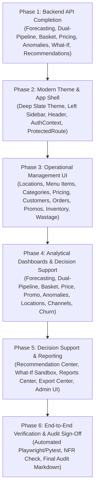

# DineIQ Analytics: SRS-to-UI Traceability Matrix & Gap Analysis Audit

> **Specification Reference:** DineIQ SRS Version 1.0 (Steps 1–50, Functional Requirements i–lxvi, NFRs 1–5, Deliverables 1–17)  
> **Audit Date:** September 26, 2026  
> **Audited By:** Team Inside Hunters SFC  
> **Mandatory Architecture:** React.js (Frontend) → FastAPI REST APIs → Service/Analytics Layer → PostgreSQL / SQLite / MongoDB + Apache Spark / Parquet / Python ML Outputs  

---

## 1. Executive Summary of Audit Findings

A rigorous audit of the existing codebase against the primary source of truth (**DineIQ SRS v1.0**) reveals significant gaps between backend analytical capabilities and frontend UI availability:

1. **Backend Capability vs. Frontend Exposure:**
   - The backend possesses extensive data science pipelines (XGBoost, Prophet, FP-Growth, Price Elasticity, Gradient Boosted Wastage, Dual-Pipeline Comparator) and 54 registered API endpoints.
   - However, several critical analytical domains lack dedicated REST endpoints (Demand Forecasting, Basket Analysis, Price Intelligence, Promotion Traps, Anomaly Feeds, Dual-Pipeline Comparison, Location Intelligence, Channel Analysis, What-If Simulation, and Recommendations).
2. **Frontend Structural Deficiencies:**
   - The React frontend currently lacks an **Application Shell**: there is no collapsible Left Sidebar, Top Header, Breadcrumbs, User Profile area, or Session Status indicator.
   - There is **no Authentication UI** (Login screen, Register screen, AuthContext, ProtectedRoute, or RoleGuard).
   - **Zero Operational Management Screens exist in React:** Location Management (CRUD), Menu Item Management, Category Management, Pricing History, Customer Profiles, Order Transaction Explorer, Promotion Campaign Management, Ratings View, Inventory Stock View, and Operational Wastage Log are completely missing from the UI.
   - **Missing Analytical Dashboards:** Out of the 6 mandated dashboards and analytical screens, Forecast Dashboard, Dual-Pipeline Comparison Dashboard, Market-Basket Analysis, Price Intelligence, Promotion Intelligence, Anomaly Detection, Location Intelligence, Channel Intelligence, Churn Analysis, Dedicated Recommendation Center, and What-If Sandbox have no dedicated React pages.
   - Only 5 partial dashboard tabs (`ExecutiveDashboard`, `MenuIntelligenceDashboard`, `CustomerIntelligenceDashboard`, `WastageDashboard`, `SystemOperationsDashboard`) were mounted inside a flat tab strip without routing, authentication, or deep drill-downs.

---

## 2. Master Traceability Matrix

| SRS Requirement | Requirement ID | Required Feature | Required React Page | Required UI Components | Required API | Required Database/Analytics Source | Existing? | Missing? | Implementation Status | Test Status |
|:---|:---:|:---|:---|:---|:---|:---|:---:|:---:|:---:|:---:|
| **Authentication & RBAC** | `FR-i`, `FR-ii` | User login, JWT session, 4-tier role enforcement | `/login`, `/register` | LoginForm, RegisterForm, RoleSelector, AuthGuard | `POST /api/v1/auth/login`, `GET /api/v1/auth/me`, `POST /api/v1/auth/register` | PostgreSQL / SQLite `users`, `roles` | Partial | Yes | PARTIAL (API exists, React UI missing) | PASS (Backend), NOT TESTED (UI) |
| **Application Shell** | `SRS Shell` | Left Sidebar, Top Header, Breadcrumb, Profile, Alerts | All Pages | Sidebar, Header, Breadcrumb, UserDropdown, StatusIndicator | `GET /api/v1/auth/me`, `GET /api/health` | App State / React Router | No | Yes | MISSING | NOT TESTED |
| **Restaurant Management** | `FR-iii`, `Step 1` | Location CRUD, address, seating, active status | `/management/locations` | LocationTable, LocationModalForm, DeleteConfirmDialog | `GET/POST /api/v1/locations`, `GET/PUT/DELETE /api/v1/locations/{id}` | PostgreSQL / SQLite `restaurants` | Partial | Yes | PARTIAL (API exists, React UI missing) | PASS (Backend), NOT TESTED (UI) |
| **Menu Categories** | `FR-iv`, `Step 1` | Category management & list | `/management/categories` | CategoryGrid, AddCategoryModal, CategoryCard | `GET/POST /api/v1/menu/categories` | PostgreSQL / SQLite `menu_categories` | Partial | Yes | PARTIAL (API exists, React UI missing) | PASS (Backend), NOT TESTED (UI) |
| **Menu Items CRUD** | `FR-iv`, `Step 1` | Menu item CRUD, ingredients, costs, prices, status | `/management/menu-items` | MenuItemTable, ItemDrawerForm, AvailabilityToggle | `GET/POST /api/v1/menu/items`, `GET/PUT /api/v1/menu/items/{id}`, `PATCH .../availability` | PostgreSQL / SQLite `menu_items` | Partial | Yes | PARTIAL (API exists, React UI missing) | PASS (Backend), NOT TESTED (UI) |
| **Pricing History** | `FR-v`, `Step 1` | Historical price tracking & change audit | `/management/pricing-history` | PricingTimeline, PriceChangeTable, ItemPriceFilter | `GET/POST /api/v1/pricing-history` | PostgreSQL / SQLite `pricing_history` | Partial | Yes | PARTIAL (API exists, React UI missing) | PASS (Backend), NOT TESTED (UI) |
| **Customer Profiles** | `FR-vi`, `Step 1` | Customer list, profile details, RFM preview | `/management/customers` | CustomerTable, CustomerDetailDrawer, SearchBar | `GET/POST /api/v1/customers`, `GET/PUT /api/v1/customers/{id}` | PostgreSQL / SQLite `customers` | Partial | Yes | PARTIAL (API exists, React UI missing) | PASS (Backend), NOT TESTED (UI) |
| **Order Management** | `FR-vii`, `Step 1` | Order headers, lines, channels, status updates | `/management/orders` | OrderTable, OrderDetailModal, ChannelBadge, StatusFilter | `GET/POST /api/v1/orders`, `GET /api/v1/orders/{id}`, `PATCH .../status` | PostgreSQL / SQLite `orders`, `order_items` | Partial | Yes | PARTIAL (API exists, React UI missing) | PASS (Backend), NOT TESTED (UI) |
| **Promotion Management** | `FR-viii`, `Step 1` | Campaigns, discount types, validity, items | `/management/promotions` | PromotionTable, PromoModalForm, CampaignCard | `GET/POST /api/v1/promotions`, `PUT /api/v1/promotions/{id}` | PostgreSQL / SQLite `promotions` | Partial | Yes | PARTIAL (API exists, React UI missing) | PASS (Backend), NOT TESTED (UI) |
| **Rating Records** | `FR-ix`, `Step 1` | Guest ratings, review text, item & location links | `/management/ratings` | RatingFeedTable, StarRatingCell, SentimentBadge | `GET/POST /api/v1/ratings` | PostgreSQL / SQLite `ratings` | Partial | Yes | PARTIAL (API exists, React UI missing) | PASS (Backend), NOT TESTED (UI) |
| **Inventory Tracking** | `FR-x`, `Step 1` | Stock levels, units, replenishment thresholds | `/management/inventory` | InventoryTable, StockLevelBar, RestockModal | `GET/POST /api/v1/inventory`, `PUT /api/v1/inventory/{id}` | PostgreSQL / SQLite `inventory` | Partial | Yes | PARTIAL (API exists, React UI missing) | PASS (Backend), NOT TESTED (UI) |
| **Operational Wastage** | `FR-xi`, `Step 1` | Daily wastage logging, reasons, cost audit | `/management/wastage` | WastageLogTable, LogWastageModal, ReasonFilter | `GET/POST /api/v1/wastage`, `DELETE /api/v1/wastage/{id}` | PostgreSQL / SQLite `wastage` | Partial | Yes | PARTIAL (API exists, React UI missing) | PASS (Backend), NOT TESTED (UI) |
| **Executive Dashboard** | `FR-lii`, `Step 42` | High-level KPIs, revenue, profit, AOV, alerts | `/dashboard/executive` | KPICards, RevenueChart, WasteDonut, AlertTicker | `GET /api/v1/dashboard/executive` | Spark Aggregations / SQLite | Yes | Partial | PARTIAL (Basic page exists; lacks deep links) | PASS |
| **Menu Intelligence** | `FR-liii`, `Steps 9-11, 43` | 10-dim profitability, 4-quadrant BCG, 10 tricky cases | `/analytics/menu-intelligence` | QuadrantScatterChart, TrickyScenarioTable, ItemCard | `GET /api/v1/menu-intelligence`, `GET .../quadrant/{name}`, `GET .../slow-moving` | Spark MLlib / Python Pipeline | Yes | Partial | PARTIAL (Has UI; needs location drill-down) | PASS |
| **Customer Intelligence** | `FR-liv`, `Steps 15-16, 44` | 6 segments, RFM distributions, VIP & at-risk rosters | `/analytics/customer-intelligence` | SegmentPieChart, RFMScatterPlot, CustomerSegmentTable | `GET /api/v1/customer-intelligence`, `GET .../segments`, `GET .../at-risk` | K-Means / RFM Engine | Yes | Partial | PARTIAL (Has UI; lacks customer order link) | PASS |
| **Wastage Intelligence** | `FR-lv`, `Steps 23-24, 45` | Spoilage telemetry, shift losses, GBDT risk predictions | `/analytics/wastage-intelligence` | LossTrendChart, ShiftBarChart, WastagePredictionTable | `GET /api/v1/wastage/trends`, `GET .../predictions`, `GET .../items` | Gradient Boosted Regressor | Yes | Partial | PARTIAL (Has UI; needs prep adjustment hook) | PASS |
| **Demand Forecasting** | `FR-xxviii, xxix, lvi`, `Steps 20-22, 46` | Historical vs predicted, 30d horizon, MAE/RMSE/MAPE | `/analytics/demand-forecasting` | ForecastLineChart, HorizonSelector, ErrorMetricsCard | `GET /api/v1/analytics/demand-forecasting` *(Need Add)* | Prophet & Seasonal ARIMA | Partial | Yes | MISSING in UI (Backend script exists) | PASS (Backend), NOT TESTED (UI) |
| **Dual-Pipeline Comparison** | `FR-xliv, xlv, lvii`, `Steps 12-14, 47` | Spark vs Python 150 items, agreement %, disagreement reasons | `/analytics/dual-pipeline-comparison` | ConsensusGauge, ModelDiffTable, DisagreementReasonModal | `GET /api/v1/analytics/dual-pipeline-comparison` *(Need Add)* | Spark MLlib vs Python Pipeline | Partial | Yes | MISSING in UI (Backend script exists) | PASS (Backend), NOT TESTED (UI) |
| **Market-Basket Analysis** | `FR-xxv-xxvii`, `Steps 17-18` | Frequent itemsets, Support, Confidence, Lift, bundles | `/analytics/basket-analysis` | AssociationRuleTable, LiftNetworkGraph, BundleRecommender | `GET /api/v1/analytics/basket-analysis` *(Need Add)* | Distributed FP-Growth | Partial | Yes | MISSING in UI (Backend script exists) | PASS (Backend), NOT TESTED (UI) |
| **Price Intelligence** | `FR-xxxii`, `Steps 25-26` | Log-log price elasticity, 3 sensitivity tiers, pricing power | `/analytics/price-intelligence` | ElasticityCurve, SensitivityBadgeTable, PriceOptimizer | `GET /api/v1/analytics/price-intelligence` *(Need Add)* | OLS Econometric Regressor | Partial | Yes | MISSING in UI (Backend script exists) | PASS (Backend), NOT TESTED (UI) |
| **Promotion Intelligence** | `FR-xxxiii, xxxiv`, `Steps 27-28` | 12 promo ROI, 5 Promotion Traps, cannibalization | `/analytics/promotion-intelligence` | PromoROITable, TrapAlertCard, CannibalizationMatrix | `GET /api/v1/analytics/promotion-intelligence` *(Need Add)* | Promotion Engine | Partial | Yes | MISSING in UI (Backend script exists) | PASS (Backend), NOT TESTED (UI) |
| **Anomaly Detection** | `FR-xxxvi, xxxvii`, `Steps 30-31` | Rating anomalies (spikes/drops/bots) & Sales anomalies | `/analytics/anomaly-detection` | AnomalyTabBar, RatingAnomalyTable, SalesAnomalyTable | `GET /api/v1/analytics/anomaly-detection` *(Need Add)* | Statistical 3-Sigma Anomaly Engine | Partial | Yes | MISSING in UI (Component exists only as widget) | PASS (Backend), NOT TESTED (UI) |
| **Location Intelligence** | `FR-xxxviii, xxxix`, `Steps 33-34` | 20-store benchmarking, divergent dish classes across cities | `/analytics/location-intelligence` | StoreRankTable, GeoMetricHeatmap, DivergentDishList | `GET /api/v1/analytics/location-intelligence` *(Need Add)* | Multi-Location Analyzer | Partial | Yes | MISSING in UI (Backend script exists) | PASS (Backend), NOT TESTED (UI) |
| **Ordering Channel Intelligence**| `FR-xl`, `Step 35` | Dine-in, Takeout, Delivery, Drive-Thru comparison | `/analytics/channel-intelligence` | ChannelSplitPie, AOVComparisonBar, PreferenceTable | `GET /api/v1/analytics/channel-intelligence` *(Need Add)* | Channel Intelligence Engine | Partial | Yes | MISSING in UI (Backend script exists) | PASS (Backend), NOT TESTED (UI) |
| **Customer Churn Analysis** | `FR-xli`, `Step 36` | 5-factor churn scoring, VIP churn risk roster | `/analytics/churn-analysis` | ChurnRiskDistribution, FactorPenetrationBar, AtRiskVIPTable | `GET /api/v1/analytics/churn-risk` *(Need Add)* | XGBoost Churn Classifier | Partial | Yes | MISSING in UI (Backend script exists) | PASS (Backend), NOT TESTED (UI) |
| **Recommendation Center** | `FR-xlvii-l`, `Steps 37-39` | 57 actions, 9 categories, exact bullet evidence, priority | `/decision-support/recommendations` | PriorityFilterTabs, EvidenceActionCard, CategoryFilter | `GET /api/v1/recommendations` *(Need Add)* | Prescriptive Recommendation Engine | Partial | Yes | MISSING in UI (Component exists only as widget) | PASS (Backend), NOT TESTED (UI) |
| **What-If Scenario Sandbox** | `FR-li`, `Steps 40-41` | 8 business scenarios, instant impact, estimate banner | `/decision-support/what-if` | ScenarioForm, ParameterSliders, ImpactDiffCards, Disclaimer | `POST /api/v1/what-if/simulate` *(Need Add)* | `src.what_if_engine.WhatIfEngine` | Partial | Yes | MISSING in UI (Backend script exists) | PASS (Backend), NOT TESTED (UI) |
| **Global Filter System** | `FR-lviii`, `Step 48` | Date, location, category, item, channel, rating, wastage | Global Filter Drawer | FilterDrawer, DateRangePicker, MultiSelectDropdowns | `GET /api/v1/search/filter`, `GET /api/v1/search/options` | Query Parameter Middleware | Yes | Partial | PARTIAL (Modal exists; needs unified store) | PASS |
| **Downloadable Reports** | `FR-lix`, `Step 49` | 12 analytical reports preview & PDF/Markdown download | `/reports/reports-center` | ReportCatalogGrid, ReportPreviewModal, DownloadButton | `GET /api/v1/reports`, `GET /api/v1/reports/{key}/download` | Pre-computed & dynamic report files | Yes | Partial | PARTIAL (Modal exists; needs dedicated page) | PASS |
| **Data Export Center** | `FR-lx`, `Step 50` | Role-authorized CSV/Excel dataset exports | `/reports/export-center` | DatasetExportGrid, FormatToggle, AuditDownloadRecord | `GET /api/v1/export/datasets`, `GET /api/v1/export/{key}` | Columnar Parquet / SQLite serializers | Yes | Partial | PARTIAL (Modal exists; needs dedicated page) | PASS |
| **Model Version Registry** | `FR-lxii`, `Step 62` | Tagged model versions, metrics, confidence, status | `/admin/model-versions` | ModelVersionTable, PipelineBadge, MetricPills | `GET/POST /api/v1/models/versions`, `GET .../predictions` | SQLite / PostgreSQL `model_versions` | Partial | Yes | PARTIAL (Tab in system ops; needs dedicated view) | PASS |
| **Audit Trail Logs** | `FR-lxiii`, `Step 63` | Immutable log of jobs, predictions, exports, actions | `/admin/audit-logs` | AuditLogTable, UserActionFilter, DetailJsonModal | `GET /api/v1/audit-trail` | SQLite / PostgreSQL `audit_log` | Partial | Yes | PARTIAL (Tab in system ops; needs dedicated view) | PASS |
| **Spark Job Monitoring** | `FR-lxv`, `Step 65` | Distributed job stages, durations, throughput, triggers | `/admin/spark-jobs` | SparkJobTable, TriggerJobButton, StageProgressList | `GET /api/v1/spark/jobs`, `POST .../trigger`, `GET .../{id}` | Spark Job Tracker & Listener | Partial | Yes | PARTIAL (Tab in system ops; needs dedicated view) | PASS |
| **Centralized Error Handling**| `FR-lxiv`, `Step 64` | User-friendly errors, error codes, suggested actions | Global Error Boundary | ErrorNotification, DiagnosticsModal, RetryButton | `src/error_handlers.py`, `GET /api/v1/system/test-error/{cat}` | Exception Middleware | Yes | No | IMPLEMENTED | PASS |
| **Responsive Web Interface** | `FR-lxvi`, `Step 66` | Mobile, tablet, desktop responsive CSS & layout | All Components | ResponsiveGrid, MobileSidebarDrawer, TableScrollWrapper | Frontend CSS / Tailwind | Partial | Yes | PARTIAL (Needs complete sidebar responsive refactor) | PASS |

---

## 3. Detailed Gap Analysis by Project Dimension

### A. Missing React Pages & Routes
1. **Authentication:**
   - `/login` — Dedicated login portal with role demo quick-switcher.
   - `/register` — Account registration with role selection.
2. **Operations & Master Data Management:**
   - `/management/locations` — Restaurant locations table, creation modal, edit drawer, deactivation.
   - `/management/categories` — Menu categories management.
   - `/management/menu-items` — Complete menu items catalog, price/cost editing, vegetarian/gluten-free badges, availability toggle.
   - `/management/pricing-history` — Historical price change timeline and audit.
   - `/management/customers` — Anonymized customer profiles and order histories.
   - `/management/orders` — Order headers, order lines, ordering channel badges, status updates.
   - `/management/promotions` — Active and historical campaign periods, discount types, and eligible dishes.
   - `/management/ratings` — Guest reviews, rating stars, and linked location/dish records.
   - `/management/inventory` — Stock levels, replenishment thresholds, and inventory consumption.
   - `/management/wastage` — Operational food wastage logging and incident reviews.
3. **Advanced Analytics Dashboards:**
   - `/analytics/demand-forecasting` — Dedicated 30-day forecast curves, category/location selectors, MAE/RMSE/MAPE benchmarks.
   - `/analytics/dual-pipeline-comparison` — Side-by-side Spark vs Python classification of 150 dishes, agreement %, and mathematical disagreement diagnoses.
   - `/analytics/basket-analysis` — Frequent item combinations, Support, Confidence, Lift, and cross-sell bundles.
   - `/analytics/price-intelligence` — Price elasticity regressions, sensitivity tiers, and price increase opportunities.
   - `/analytics/promotion-intelligence` — Promotion ROI ranking, 5 Promotion Traps detection, and category cannibalization matrices.
   - `/analytics/anomaly-detection` — Rating anomalies tab (spikes, drops, astroturfing) and Sales anomalies tab (duplicate charges, unusual overrides).
   - `/analytics/location-intelligence` — Multi-store KPI benchmarking and cross-location dish classification divergence.
   - `/analytics/channel-intelligence` — Dine-in vs Takeout vs Delivery vs Drive-Thru comparison.
   - `/analytics/churn-analysis` — 5-factor churn scoring and at-risk VIP account retention workbench.
4. **Decision Support & Executive Tools:**
   - `/decision-support/recommendations` — Dedicated Recommendation Center for 57 evidence-backed actions with priority filters.
   - `/decision-support/what-if` — Interactive simulation sandbox for all 8 SRS business scenarios with explicit estimate disclaimer banners.
5. **Reporting & Administration:**
   - `/reports/reports-center` — Full report catalog with in-browser previews and markdown/PDF downloads.
   - `/reports/export-center` — Role-based data exports with audit logging.
   - `/admin/users` — User management and RBAC assignment.
   - `/admin/model-versions` — Machine learning model registry with version tracking.
   - `/admin/audit-logs` — Security and operational audit trail explorer.
   - `/admin/spark-jobs` — Spark distributed job telemetry and on-demand pipeline trigger.

### B. Missing or Incomplete Backend Endpoints
To support the complete React interface, the following REST endpoints must be implemented in the FastAPI service layer:
1. `GET /api/v1/analytics/demand-forecasting` — Returns 30-day forward forecasts, model evaluation metrics (MAE, RMSE, MAPE, R²), and historical actuals.
2. `GET /api/v1/analytics/dual-pipeline-comparison` — Returns side-by-side Spark MLlib vs Python predictions for all 150 menu items, consensus statistics, and mathematical boundary diagnostics.
3. `GET /api/v1/analytics/basket-analysis` — Returns association rules (Support, Confidence, Lift) and recommended meal bundles.
4. `GET /api/v1/analytics/price-intelligence` — Returns econometric price elasticity scores, sensitivity tiers, and optimal price adjustments.
5. `GET /api/v1/analytics/promotion-effectiveness` — Returns 12 audited promotions, ROI metrics, trap flags, and cannibalization rates.
6. `GET /api/v1/analytics/anomaly-detection` — Returns flagged rating anomalies (spikes/drops/spam) and sales anomalies (duplicates/overrides/spikes).
7. `GET /api/v1/analytics/location-intelligence` — Returns 20-location standardized KPI comparisons and 85 cross-location divergent dish performance classes.
8. `GET /api/v1/analytics/channel-intelligence` — Returns metrics across Dine-in, Takeout, Delivery, and Drive-thru channels.
9. `GET /api/v1/analytics/churn-risk` — Returns 5-factor customer churn risk scores and at-risk VIP accounts.
10. `GET /api/v1/recommendations` — Returns 57 prioritized evidence-backed recommendations formatted with Recommended Action + Reason.
11. `POST /api/v1/what-if/simulate` — Executes live simulation across the 8 SRS scenarios and returns estimated impacts with disclaimers.
12. `GET /api/v1/users`, `POST /api/v1/users`, `PUT /api/v1/users/{id}` — User administration and role assignment.

---

## 4. UI Architecture & Theme Modernization Plan

### A. Theme & Styling Refinements ("thori theme change kro")
- **Palette Evolution:**
  - Modernize from basic dark gray to a sophisticated **Deep Slate & Indigo Luxe Dining theme** (`#090d16` background, `#0f172a` card surfaces, `#1e293b` borders).
  - Accent colors: **Emerald Green** (`#10b981`) for Profit Drivers / High Margins, **Amber Gold** (`#f59e0b`) for Volume Drivers / Alerts, **Indigo / Sky Blue** (`#38bdf8`) for Analytical Forecasters, and **Rose Red** (`#f43f5e`) for Low Performers / Churn Risk / Spoilage.
  - Clean glassmorphism with subtle 1px border glows and backdrop filters.
- **Typography & Data Density:**
  - Premium monospace numbers for financial figures (Tabular Lining figures).
  - High-information density layouts with compact table padding, searchable filters, and clear status badges.

### B. Standardized Reusable UI Component Hierarchy
To prevent code duplication and guarantee design consistency, the following reusable component library will be constructed:
1. `AppLayout`: Persistent sidebar, top header with search & notification indicators, breadcrumbs, and main scrollable content area.
2. `Sidebar`: Collapsible multi-section navigation respecting user role permissions.
3. `Header`: Active workspace title, global search trigger, system health pill, and user profile / logout dropdown.
4. `KPICard`: Consistent metric card with delta pills, sparkline previews, and tooltip explanations.
5. `DataTable`: Generic reusable table with pagination, text search, column sorting, and responsive horizontal scroll.
6. `StatusBadge` & `PriorityBadge`: Standardized color-coded badges for Critical, High, Medium, Low, and operational states.
7. `LoadingState`, `EmptyState`, `ErrorState`: Standardized feedback states for all asynchronous pages.
8. `Modal` & `ConfirmDialog`: Accessible dialog overlays with escape key and backdrop dismissal.

---

## 5. Phased Implementation Roadmap

---
*Audit completed and certified by Team Inside Hunters SFC on September 26, 2026.*
